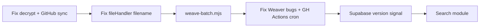

# Project Coeus — Implementation Plan

Audit of `.cursor/features.md` against the existing codebase, with status and a prioritized completion roadmap.

> **Last updated:** 2026-07-01  
> **Note:** `features.md` still describes the original spec (`persistent/raw-notes`, GitHub Models, Transformers.js, Octokit). The code has diverged — especially toward **Gemini** and a separate **conversation chat** flow. This plan bridges that gap.

---

## Feature Status Matrix

| Module | Feature | Status | What exists | What's missing / wrong |
|--------|---------|--------|-------------|------------------------|
| **M1** | Telegram Bot Listener | 🟡 Halfway | `telegramBot.mjs` handles `text` + `document` | No `TELEGRAM_USER_ID` auth; no voice; no `/search` or other commands |
| **M1** | MD capture (1.1) | 🟡 Halfway | `fileHandler.mjs` downloads `.md`, encrypts, writes to `notes/raw-notes/` | Uses **UUID filename**, not original title (conflicts with `project-overview.md`); no frontmatter wrapper from spec |
| **M1** | Text capture (1.1) | 🟡 Different path | `textHandler.mjs` → Gemini chat + `notes/conversation/` JSON logs | Not the spec's "raw note wrapper"; it's a **brainstorm side-channel** |
| **M1** | GitHub sync (1.2) | ❌ Broken | `entrypoint.sh` sparse-checkout + git remote setup | `GitHubHelper.syncToGitHub()` is **fully commented out** — nothing pushes to GitHub from VPS |
| **M1** | Octokit + retries + TG error alerts | ❌ Not started | — | No Octokit, no retry logic, no user-facing GitHub failure alerts |
| **M2** | GitHub Actions cron (2.1) | 🟡 Skeleton only | `.github/workflows/distill.yml` with `workflow_dispatch` | Cron **commented out**; file named `distill.yml` not `weave.yml`; runs missing `distill-script.js` |
| **M2** | Batch raw-notes processor | ❌ Not started | — | No script loops `notes/raw-notes/`, decrypts, weaves, archives/deletes |
| **M2** | LLM metadata (2.2) | 🟡 Done differently | `Weaver.mjs` → Gemini `gemini-2.5-flash` JSON schema | Spec says **GitHub Models `gpt-4o-mini`** — not implemented |
| **M2** | Embeddings (2.3) | 🟡 Done differently | `Weaver.mjs` → Gemini `gemini-embedding-2` | Spec says **Transformers.js / MiniLM-L6-v2 (384-dim)** — not implemented; index vectors are Gemini-sized |
| **M2** | Cosine similarity + wiki links (2.4) | 🟡 Mostly done | Dynamic tag-aware thresholds, top-5 links, bidirectional `[[Links]]` sections | Only works when `startWeaving()` is called manually; **tags not stored in `index.json`** (breaks `hasSharedTags`); backlink writes may corrupt **encrypted** persistent files |
| **M2** | Supabase version signal (2.5) | ❌ Not started | — | No `@supabase/supabase-js`, no `last_weave_version` update |
| **M3** | Entire search engine | ❌ Not started | — | No `/search`, Supabase, lazy loader, Transformers.js on VPS, or result formatter |
| **Extra** | Encryption | 🟡 Halfway | `cryptoUtil.encrypt()` with `ENCRYPTION_ENABLED` flag | `decrypt()` is empty — blocks batch weave + search |
| **Extra** | Docker / VPS deploy | 🟡 Halfway | `dockerfile`, `docker-compose.yml`, `entrypoint.sh` | Node 18 in Docker vs Node 24 in Actions; git-based sync disabled |
| **Extra** | Tests | 🟡 Minimal | `test/weaver.mjs` manual harness | No automated tests; `npm test` is a stub |

---

## What Is Actually Complete

Only **isolated pieces** work end-to-end in isolation:

1. **Manual weave** — run `test/weaver.mjs` → produces encrypted cards in `notes/persistent/`, updates `notes/index.json`, adds wiki links.
2. **Telegram file receive** — bot accepts `.md`, saves locally (if Docker volume is mounted).
3. **Telegram text chat** — Gemini conversation with per-chat memory, logged to `notes/conversation/`.

Nothing connects the full **capture → sync → nightly weave → search** pipeline yet.

---

## Architecture Drift (decide before building)

| Area | `features.md` / `project-overview.md` | Current code |
|------|--------------------------------------|--------------|
| Raw note path | `persistent/raw-notes` (features) / `notes/raw-notes` (overview) | `notes/raw-notes/` ✅ |
| LLM | GitHub Models `gpt-4o-mini` | Gemini Flash |
| Embeddings | Transformers.js MiniLM (384-dim) | Gemini `embedding-2` |
| GitHub push (VPS) | Octokit API | Git CLI (disabled) |
| Nightly job | `weave.yml` + Weaver | `distill.yml` + missing `distill-script.js` |

**Recommendation:** Pick one stack and update `features.md` + `project-overview.md` together. Gemini is already wired and working for weave/chat — fastest path is **Gemini everywhere** and drop GitHub Models / Transformers.js unless zero-cost sovereignty strictly requires them.

---

## Recommended Completion Plan

### Phase 0 — Align docs & fix blockers (1–2 days) ✅

1. ~~**Resolve path/filename contract** — `fileHandler` should save as `{original-filename}.md` (per overview), not UUID.~~
2. ~~**Implement `cryptoUtil.decrypt()`** — required for batch weave and any search that reads encrypted cards.~~
3. ~~**Re-enable `GitHubHelper`** — uncomment git add/commit/push, with retry + Telegram error reply on file capture.~~
4. ~~**Remove hardcoded API key fallback** in `Weaver.mjs`.~~
5. ~~**Update `features.md`** to match chosen stack (paths, Gemini, embedding model).~~

### Phase 1 — Finish Module 1: Ingestion gatekeeper (2–3 days)

1. Add **middleware** in `telegramBot.mjs` — reject messages from non-`TELEGRAM_USER_ID` users.
2. **Fix `fileHandler`** — preserve original title, optional frontmatter (`captured_at`, `source: telegram`), success/failure Telegram replies.
3. **Wire GitHub sync** — after every capture, push `notes/raw-notes/` to private notes repo.
4. *(Optional)* Voice → Telegram transcription → same raw-notes path.
5. *(Optional)* Clarify text handler role: keep as "conversation distill input" or remove from M1 scope.

### Phase 2 — Finish Module 2: Nightly weaver (3–5 days)

1. **Create `src/weave-batch.mjs`** (or rename/fix `distill-script.js`):
   - List `notes/raw-notes/*.md`
   - Decrypt each file
   - Call `startWeaving(content)` (or pass filename as title override)
   - Move processed files to `notes/raw-notes/processed/` or delete
2. **Fix `Weaver.mjs` bugs:**
   - Store `tags` in `index.json` entries
   - Decrypt before backlink edits on persistent files; re-encrypt after
   - Use uploaded filename as title when provided (skip LLM title generation for pre-titled notes)
3. **Fix GitHub Actions workflow:**
   - Rename to `weave.yml` (or keep `distill.yml` but point to real script)
   - Enable cron: `0 19 * * *` (00:00 HKT) or `0 0 * * *` (00:00 UTC) — pick one
   - Run `node src/weave-batch.mjs` instead of missing `distill-script.js`
4. **Supabase signaler** — after successful weave, `UPDATE system_status SET last_weave_version = Date.now()`.
5. **Commit/push** woven cards + `index.json` from Actions (workflow already has notes submodule checkout).

### Phase 3 — Build Module 3: Search (3–4 days)

1. Add **`SearchHandler`** + `bot.command('search', ...)` in `telegramBot.mjs`.
2. **`supabaseClient.mjs`** — fetch `last_weave_version`, compare to in-memory `localVersion`.
3. **`indexLoader.mjs`** — lazy-fetch `notes/index.json` from GitHub Raw (with token for private repo) when stale.
4. **`searchEngine.mjs`** — embed query (same model as index: Gemini or Transformers.js — must match weave embeddings), cosine rank, top 5 where score > 0.40.
5. **Telegram formatter** — titles, match %, tags, wiki-link refs; optional inline buttons.

### Phase 4 — Harden & refine (ongoing)

1. Automated tests for: encrypt/decrypt round-trip, weave batch, similarity scoring, search ranking.
2. `npm test` script pointing to test files.
3. Align Docker Node version with Actions (both 24).
4. Conversation → distill pipeline (if `distill.yml` was meant to process `notes/conversation/` into raw notes — currently unimplemented).
5. Obsidian compatibility check — encrypted `.md` files won't open in Obsidian unless decrypted locally; document or adjust encryption scope (encrypt content only vs whole file).

---

## Critical Path

### Highest-impact next 3 tasks

1. Implement `decrypt()` + re-enable `GitHubHelper` — unblocks the whole pipeline.
2. Build `weave-batch.mjs` + fix the Actions workflow — makes Phase B real.
3. Fix `fileHandler` to use original filename — aligns capture with overview and Obsidian titles.

---

## Summary

`features.md` has every checkbox unchecked, which matches reality: **~30% built**, mostly as prototypes with architectural drift. The weave engine is the strongest piece; ingestion sync and search are the biggest gaps.
